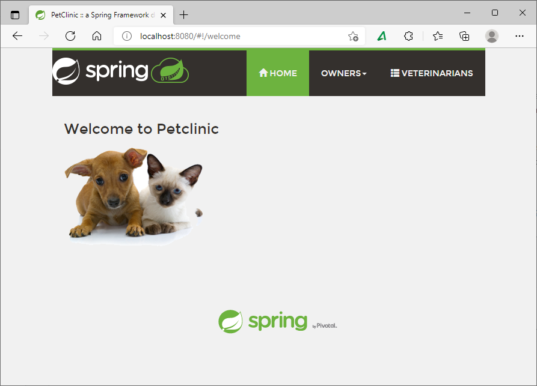

# 102-opentelemetry-spring-demo-app

This cookbook helps to setup Java microservices application with the [Aternity APM OpenTelemetry collector container](https://hub.docker.com/r/aternity/apm-collector) on a Docker host, to start practicing Digital Experience Monitoring (DEM) with [Aternity APM](https://www.aternity.com/application-performance-monitoring/) and [OpenTelemetry](https://opentelemetry.io/).

The sample app is the famous Java Community application called [Spring PetClinic Microservices](https://github.com/spring-petclinic/spring-petclinic-microservices). It uses [ZipKin](https://zipkin.io/) instrumentation and libraries. The [Aternity APM OpenTelemetry collector](https://hub.docker.com/r/aternity/apm-collector) takes the Tracing Server role.

## Prerequisites

1. an Aternity APM account
2. a Docker host, for example [Docker Desktop](https://www.docker.com/products/docker-desktop)

## Step by Step

### Connect to Aternity APM webconsole

Navigate to Aternity APM (for example [https://apm.myaccount.aternity.com](https://apm.myaccount.aternity.com)) > Agents > Install Agents:

1. Find your **CustomerID**, for example *12341234-12341234-13241234*
2. Grab **SaaS Analysis Server Host**, for example *agents.apm.myaccount.aternity.com*

### Configure the Aternity OpenTelemetry Collector with your CustomerID & SaaS Analysis Server Host

Download a local copy of the file [docker-compose.yml](docker-compose.yml), for example in a folder `Tech-Community/102-opentelemetry-spring-demo-app`

Edit the YAML file docker-compose.yml and in the *tracing-server* section, replace the following tokens with the information from step [1] and save:
1. `${ATERNITY_CUSTOMER_ID}`
2. `${ATERNITY_SAAS_SERVER_HOST}`  

```yaml
  tracing-server:
    image: aternity/apm-collector
    container_name: tracing-server
    mem_limit: 512M
    environment:
      - SERVER_URL=wss://${ATERNITY_SAAS_SERVER_HOST}/?RPM_AGENT_CUSTOMER_ID=${ATERNITY_CUSTOMER_ID}
    ports:
     - 9411:9411
```

For example:

```yaml
  tracing-server:
    image: aternity/apm-collector
    container_name: tracing-server
    mem_limit: 512M
    environment:
      - SERVER_URL=wss://agents.apm.myaccount.aternity.com/?RPM_AGENT_CUSTOMER_ID=12341234-12341234-13241234
    ports:
     - 9411:9411
```


### Start the `spring-petclinit-microservices` app

Open a shell

Go in the folder where you keep the [docker-compose.yml](docker-compose.yml) file you just configured. For example:

```shell
cd Tech-Community/102-opentelemetry-spring-demo-app
```

Start the containers:

```shell
docker-compose up
```

### Exercise the application

Browse http://localhost:8080 and click around to generate some telemetry that will be collected by the Aternity APM OpenTelemetry Collector



### Open the Aternity APM webconsole to visualize and analyze the traces collected for every transactions

The [Aternity APM OpenTelemetry Collector](https://hub.docker.com/r/aternity/apm-collector) keeps 100% of the traces to provide full fidelity analysis. There is no data sampling.

Search transactions:


Browse the spans for the selected transaction:


## Notes 

### Support

Please visit [Aternity website](https://www.aternity.com/) if your need Support or Training.

### Stop the app and all the containers

Press CTRL + C in the shell where it is running.

Or in a shell, go to the folder where you keep the [docker-compose.yml](docker-compose.yml) and run:

```shell
docker-compose down
```

#### License

Copyright (c) 2022 Aternity. The contents provided here are licensed under the terms and conditions of the MIT License accompanying the software ("License"). The scripts are distributed "AS IS" as set forth in the License. The script also include certain third party code. All such third party code is also distributed "AS IS" and is licensed by the respective copyright holders under the applicable terms and conditions (including, without limitation, warranty and liability disclaimers) identified in the license notices accompanying the software.
