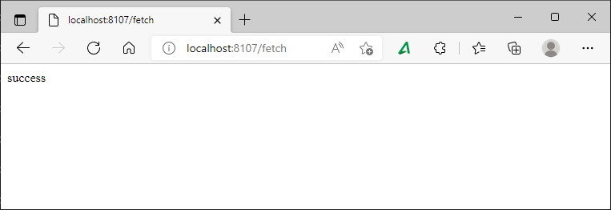

# 107-opentelemetry-autoinstrumentation-nodejs-app

In this cookbok, the [OpenTelemetry](https://opentelemetry.io/) automatic instrumentation is added to a simple **nodejs** webapp (based on Express). And [Aternity APM](https://www.aternity.com/apm) collects the OTLP telemetry with the [Aternity OpenTelemetry Collector container](https://hub.docker.com/r/aternity/apm-collector).

This cookbook differs from the [cookbook 104](../104-opentelemetry-zipkin-nodejs-app), where instrumentation is manual and exports Zipkin telemetry.


## Prerequisites

1. an Aternity APM account (SaaS)
2. a Docker host, for example [Docker Desktop](https://www.docker.com/products/docker-desktop)

## Step by Step

### Step 1. Get your CustomerID & SaaS Analysis Server Host details from the Aternity APM webconsole

Navigate to Aternity APM (for example [https://apm.myaccount.aternity.com](https://apm.myaccount.aternity.com)) > Agents > Install Agents:

1. Find your **CustomerID**, for example *12341234-12341234-13241234*
2. Grab **SaaS Analysis Server Host**, for example *agents.apm.myaccount.aternity.com*

Those information are required to activate the Aternity OpenTelemetry Collector container, passing via the environment variable `SERVER_URL`. 

### Step 2. Start the containers

Download a local copy of the  [docker-compose.yaml](docker-compose.yaml) file, for example in the directory `Tech-Community/107-opentelemetry-autoinstrumentation-nodejs-app`


Start the containers using the [docker-compose.yaml](docker-compose.yaml), for example with Bash:

```bash
cd Tech-Community/107-opentelemetry-autoinstrumentation-nodejs-app

# Configure the environment variables for the Aternity OpenTelemetry Collector
export ATERNITY_SAAS_SERVER_HOST="agents.apm.myaccount.aternity.com"
export ATERNITY_CUSTOMER_ID="12341234-12341234-13241234"

docker-compose up
```

or with PowerShell:

```PowerShell
cd Tech-Community/107-opentelemetry-autoinstrumentation-nodejs-app

# Configure the environement variable for the Aternity OpenTelemetry Collector
$env:ATERNITY_SAAS_SERVER_HOST="agents.apm.myaccount.aternity.com"
$env:ATERNITY_CUSTOMER_ID="12341234-12341234-13241234"

docker-compose up
```

### Step 3. Use the app to generate some telemetry

The application should now be running. Every trace is collected by the Aternity APM OpenTelemetry Collector.

Navigate to http://localhost:8107/fetch from a browser or call the url from a command line. 



For example using curl:

```bash
curl http://localhost:8107/fetch
```

### Step 4. Open the Aternity APM webconsole to visualize and analyze the traces collected for every transaction

Search transaction, browse the spans for the selected transaction :


## Notes 

### Stop the app and all the containers

Press CTRL + C in the shell where it is running.

Or in a shell, go to the folder where you keep the [docker-compose.yaml](docker-compose.yaml) and run:

```shell
docker-compose down
```

### More details

The cookbook contains few files:
- [app.js](app.js) is a simple web app that listens http request (using Express) and exposes a `/fetch` method. 
- [trace_app_with_opentelemetry.js](trace_app_with_opentelemetry.js) is a nodejs bootstrap to run the web app and enable the OpenTelemetry instrumentation
- [Dockerfile](Dockerfile) defines the docker image to build
- [docker-compose.yaml](docker-compose.yaml) is the main file that defines the multi-containers app with two services: the instrumented nodejs web app and the Aternity OpenTelemetry Collector 

In the [docker-compose.yaml](docker-compose.yaml), on the Aternity OpenTelemetry Collector section, the image is set to be downloaded from [DockerHub](https://hub.docker.com/r/aternity/apm-collector) and the port to receive Zipkin telemetry is open.

The only thing that needs to be configured is the `SERVER_URL` variable. It contains the Aternity CustomerID and SaaS Analysis Server Host that allow the container to connect to the Aternity SaaS service and get activated. The Aternity OpenTelemetry Collector section is simple:

```yaml
services:

  opentelemetry-collector:
    
    image: registry.hub.docker.com/aternity/apm-collector:2022.4.0-4
    
    container_name: aternity-opentelemetry-collector       
    
    environment:

      SERVER_URL: "wss://${ATERNITY_SAAS_SERVER_HOST}/?RPM_AGENT_CUSTOMER_ID=${ATERNITY_CUSTOMER_ID}"

    ports:
      - "4317:4317/tcp"
```

In the [docker-compose.yaml](docker-compose.yaml) above, the `SERVER_URL` has been defined by two *docker compose variables*, to ease external configuration (ATERNITY_SAAS_SERVER_HOST and ATERNITY_CUSTOMER_ID). It can also be hard-coded, like this this:

```yaml
      SERVER_URL: "wss://agents.apm.myaccount.aternity.com/?RPM_AGENT_CUSTOMER_ID=12341234-12341234-13241234"
```

On the application container side, the `OTEL_EXPORTER_OTLP_ENDPOINT` environment variable  is used to bind the web app telemetry exporter to the collector container:

```yaml
  service107_js:   
    
    environment:  
    
      OTEL_EXPORTER_OTLP_ENDPOINT: aternity-opentelemetry-collector:4317
      OTEL_SERVICE_NAME: service107_js
```

#### License

Copyright (c) 2022 Riverbed Technology, Inc.

The contents provided here are licensed under the terms and conditions of the MIT License accompanying the software ("License"). The scripts are distributed "AS IS" as set forth in the License. The script also include certain third party code. All such third party code is also distributed "AS IS" and is licensed by the respective copyright holders under the applicable terms and conditions (including, without limitation, warranty and liability disclaimers) identified in the license notices accompanying the software.
