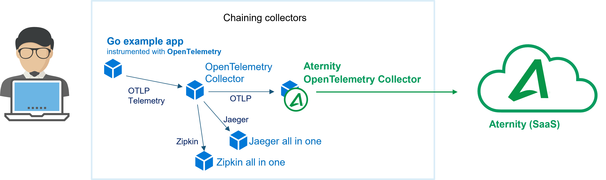

# 109-opentelemetry-collector-export

The [Aternity OpenTelemetry Collector](https://hub.docker.com/r/aternity/apm-collector) is part of the [Aternity DEM platform](https://www.aternity.com/application-performance-monitoring/) and can collect OTLP, the OpenTelemetry native telemetry protocols, as well as Jaeger and Zipkin telemetry.

In this cookbook the OpenTelemetry Collector receives the telemetry from a Go app and exports it to the [Aternity OpenTelemetry Collector](https://hub.docker.com/r/aternity/apm-collector), as well as to a Jaeger all-in-one and a Zipkin all-in-one backend.



## Prerequisites

1. an Aternity APM account (SaaS)
2. a Docker host, for example [Docker Desktop](https://www.docker.com/products/docker-desktop)

## Step by Step

### 1. Get your CustomerID & SaaS Analysis Server Host details from the Aternity APM webconsole

Navigate to Aternity APM (for example [https://apm.myaccount.aternity.com](https://apm.myaccount.aternity.com)) > Agents > Install Agents:

1. Find your **CustomerID**, for example *12341234-12341234-13241234*
2. Grab **SaaS Analysis Server Host**, for example *agents.apm.myaccount.aternity.com*

Those information are required to activate the Aternity OpenTelemetry Collector container, passing via the environment variable `SERVER_URL`. 

### 2. Start the containers

Download a local copy of the  [docker-compose.yaml](docker-compose.yaml) file, for example in the directory `Tech-Community/104-opentelemetry-zipkin-nodejs-app`

Start the containers using the [docker-compose.yaml](docker-compose.yaml), for example with Bash:

```bash
cd Tech-Community/109-opentelemetry-collector-export

# Configure the environment variables for the Aternity OpenTelemetry Collector
export ATERNITY_SAAS_SERVER_HOST="agents.apm.myaccount.aternity.com"
export ATERNITY_CUSTOMER_ID="12341234-12341234-13241234"

docker-compose up
```

or with PowerShell:

```PowerShell
cd Tech-Community/109-opentelemetry-collector-export

# Configure the environement variable for the Aternity OpenTelemetry Collector
$env:ATERNITY_SAAS_SERVER_HOST="agents.apm.myaccount.aternity.com"
$env:ATERNITY_CUSTOMER_ID="12341234-12341234-13241234"

docker-compose up
```

### Open the Aternity APM webconsole to visualize and analyze the traces collected for every transactions


## Notes 

### Stop the app and all the containers

Press CTRL + C in the shell where it is running.

Or in a shell, go to the folder where you keep the [docker-compose.yaml](docker-compose.yaml) and run:

```shell
docker-compose down
```

#### License

Copyright (c) 2022 Riverbed Technology, Inc.

The contents provided here are licensed under the terms and conditions of the MIT License accompanying the software ("License"). The scripts are distributed "AS IS" as set forth in the License. The script also include certain third party code. All such third party code is also distributed "AS IS" and is licensed by the respective copyright holders under the applicable terms and conditions (including, without limitation, warranty and liability disclaimers) identified in the license notices accompanying the software.
