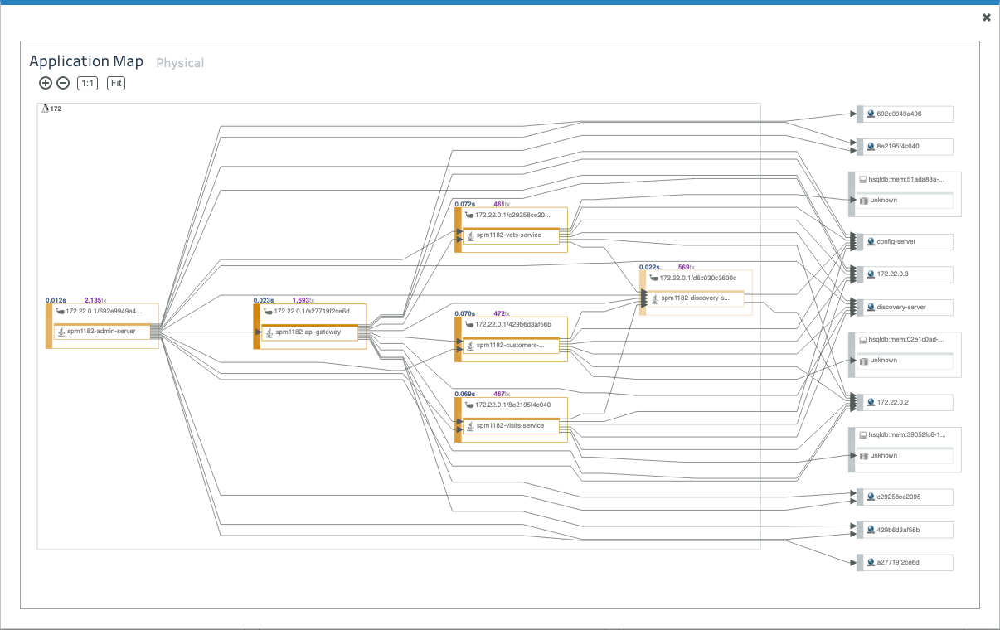
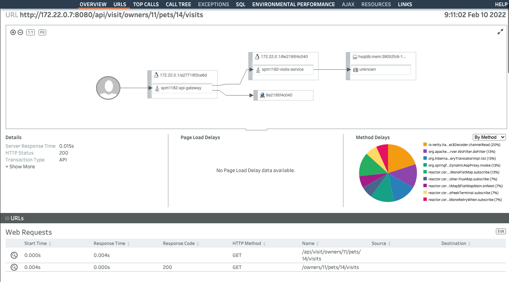

# 201-instrument-java-spring-demo-app

This cookbook shows how to setup Aternity Java APM agent auto-instrumentation on a Java app.

The demo app is the famous Java Community application called [Spring PetClinic Microservices](https://github.com/spring-petclinic/spring-petclinic-microservices), we also use to app in [Cookbook 102](../102-opentelemetry-spring-demo-app). The app is composed of multiple services that run in containers, like Config, Discovery Server, Customers, Vets, Visits and API.

Here, the [Aternity APM](https://www.aternity.com/apm) agent is injected in each service, enabling automatic instrumentation and performance monitoring. 

## Prerequisites

1. an Aternity APM account (SaaS)
2. a Docker host, for example [Docker Desktop](https://www.docker.com/products/docker-desktop)

## Step by Step

### Connect to Aternity APM webconsole

Navigate to Aternity APM (for example [https://apm.myaccount.aternity.com](https://apm.myaccount.aternity.com)) > Agents > Install Agents:

1. Find your **CustomerID**, for example *12341234-1234-1234-1234-123456789abc*
2. Grab **SaaS Analysis Server Host**, for example *agents.apm.myaccount.aternity.com* (IMPORTANT: Replace *agents* with *psockets*)
3. Download the Aternity APM Java Agent, and unzip it in the directory with the `docker-compose.yml` file.

### Configure the Aternity agent with your CustomerID & SaaS Analysis Server Host

Download a local copy of the file [docker-compose.yml](docker-compose.yml), for example in the directory `Tech-Community/201-instrument-java-spring-demo-app`

The [docker-compose.yml](docker-compose.yml) defines environment variable and mounts volume to each Java service to be be instrumentde.

```yaml
  cool-java-service:
    image: aternity/apm-collector
    entrypoint: ["java", "-jar", "MyCoolService.jar"]
    environment:
      - RVBD_ANALYSIS_SERVER=${ATERNITY_SAAS_SERVER_HOST}
      - RVBD_CUSTOMER_ID=${ATERNITY_CUSTOMER_ID}
      - JAVA_TOOL_OPTIONS=-agentpath:/agent/lib/libAwProfile64.so
      - RVBD_AGENT_FILES=1
      - RVBD_APP_INSTANCE=cool-java-service
    volumes:
      - ./agent:/agent
```

The CustomerID and SaaS Analysis Server Host can be defined manually, replacing ATERNITY_SAAS_SERVER_HOST and ATERNITY_CUSTOMER_ID directly in the file like this:

```yaml
  cool-java-service:
    image: aternity/apm-collector
    entrypoint: ["java", "-jar", "MyCoolService.jar"]
    environment:
      - RVBD_ANALYSIS_SERVER=psockets.apm.myaccount.aternity.com
      - RVBD_CUSTOMER_ID=12345678-abcd-1234-abcd-123456789012
      - JAVA_TOOL_OPTIONS=-agentpath:/agent/lib/libAwProfile64.so
      - RVBD_AGENT_FILES=1
      - RVBD_APP_INSTANCE=cool-java-service
    volumes:
      - ./agent:/agent
```


### Start the `spring-petclinit-microservices` app

Open a shell

Go in the folder where you keep the [docker-compose.yml](docker-compose.yml) file you just configured. For example:

```shell
cd Tech-Community/201-instrument-java-spring-demo-app
```

Download and unzip an Aternity APM Java Agent

```shell
unzip aternity-apm-jida-linux-xx.x.x_BLxxx.zip
```

Start the containers:

```shell
docker-compose up
```

### Exercise the application

Browse http://localhost:8080 and click around to generate some telemetry that will be collected by the Aternity APM OpenTelemetry Collector


### Open the Aternity APM webconsole to visualize and analyze the traces collected for every transaction

View the entire applications:



Search transactions:


View transaction details:



## Notes 

### Support

Please visit [Aternity website](https://www.aternity.com/) if your need Support or Training.

### Stop the app and all the containers

Press CTRL + C in the shell where it is running.

Or in a shell, go to the folder where you keep the [docker-compose.yml](docker-compose.yml) and run:

```shell
docker-compose down
```

#### License

Copyright (c) 2022 Aternity. The contents provided here are licensed under the terms and conditions of the MIT License accompanying the software ("License"). The scripts are distributed "AS IS" as set forth in the License. The script also include certain third party code. All such third party code is also distributed "AS IS" and is licensed by the respective copyright holders under the applicable terms and conditions (including, without limitation, warranty and liability disclaimers) identified in the license notices accompanying the software.
