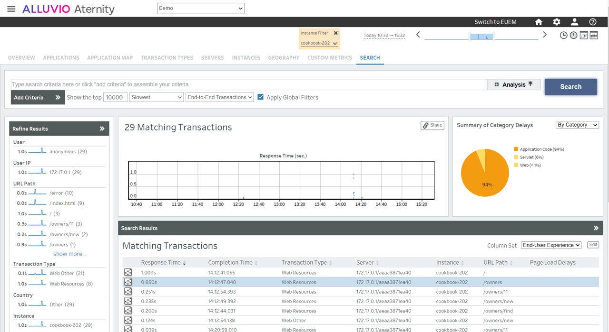

# 202-containerize-apm-with-java-app

This cookbook starts with a Java demo application that runs in a Linux container. For observability, the Aternity APM Java agent for Linux library will be containerized with the app.

The Java application is the [Spring PetClinic](https://github.com/spring-projects/spring-petclinic.git) web app, framework version.

## Prerequisites

1. a SaaS account for [Aternity APM](https://www.riverbed.com/products/application-performance-monitoring)
2. a Docker host, for example [Docker Desktop](https://www.docker.com/products/docker-desktop)

## Step by Step

### Step 1. Get Aternity APM installation details

In the Aternity APM webconsole, navigate to CONFIGURE > AGENTS > Install Agents and in the Agent Installation Steps section,

1. Find your **Customer Id**, for example *12341234-12341234-13241234*
2. Find the **SaaS Analysis Server Host** and obtain the **SaaS Psockets Server host** replacing *agents* by *psockets*. For example if the analysis server host is *agents.apm.my_environment.aternity.com* then the SaaS Psockets Server host is *psockets.apm.my_environment.aternity.com*
3. Download the **Aternity APM Java agent for Linux** package or contact [Riverbed support](https://support.riverbed.com/) to obtain a copy, for example *aternity-apm-jida-linux-12.18.0_BL546.zip*

### Step 2. Prepare the image

First, you need to save the package of the Aternity APM Java agent for Linux in local folder, for example in "Tech-Community/202-containerize-apm-with-java-app", and rename the file as "aternity-apm-jida-linux.zip" - just removing the suffix part that is the version number.

Open a shell in this local folder, and run the following container build command. The command will fetch the [Dockerfile](Dockerfile) directly from the [GitHub repository](https://github.com/Aternity/Tech-Community/tree/main/202-containerize-apm-with-java-app)

```shell
docker build --tag cookbook-202 https://github.com/Aternity/Tech-Community.git#:202-containerize-apm-with-java-app
```

### Step 3. Run the container

In the command below replace the value with your own info (see Step 1) and run a container:
1. **Customer Id** in the variable RVBD_CUSTOMER_ID, for example *12341234-12341234-13241234*
2. **SaaS Psockets Server host** in the variable RVBD_ANALYSIS_SERVER, for example *psockets.my_environment.aternity.com*

```shell
docker run --rm -p 8080:8080 -e RVBD_CUSTOMER_ID="1234-12341243" -e RVBD_ANALYSIS_SERVER="psockets.apm.my_environment.aternity.com" cookbook-202
```

### Step 4. Navigate on the app

The web application should now be available on [http://localhost:8080](http://localhost:8080).

Then, open the url in your browser and refresh the page few times to generate some traffic.

### 4. Aternity APM webconsole 

Go to the Aternity APM webconsole to observe the transactions of that instance.



#### License

Copyright (c) 2022 Riverbed

The contents provided here are licensed under the terms and conditions of the MIT License accompanying the software ("License"). The scripts are distributed "AS IS" as set forth in the License. The script also include certain third party code. All such third party code is also distributed "AS IS" and is licensed by the respective copyright holders under the applicable terms and conditions (including, without limitation, warranty and liability disclaimers) identified in the license notices accompanying the software.
