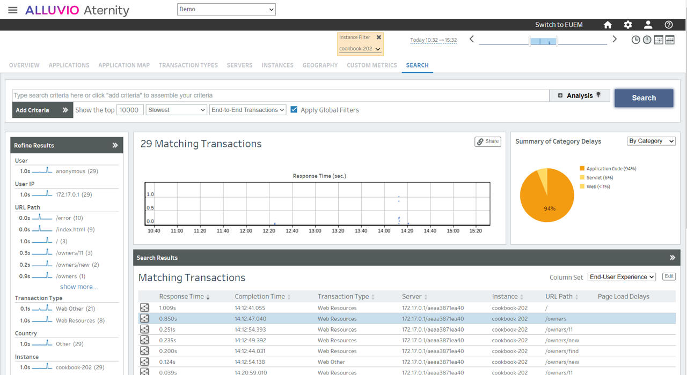

# 202-instrument-java-app-with-apm-agentless-in-container

This cookbook starts with a Java demo application that runs in a Linux container. For Observability, the APM agentless for Java (the APM Java agent library for Linux) is containerized in the same container to instrument the application.

The Java application is the [Spring PetClinic](https://github.com/spring-projects/spring-petclinic.git) web app, framework version.

## Prerequisites

1. a SaaS account for [ALLUVIO Aternity APM](https://www.riverbed.com/products/application-performance-monitoring)
2. a Docker host, for example [Docker Desktop](https://www.docker.com/products/docker-desktop)

## Step 1. Get APM installation details

In the APM webconsole, navigate to CONFIGURE > AGENTS > Install Agents and in the Agent Installation Steps section,

1. Find your **Customer Id**, for example *12341234-12341234-13241234*
2. Find the **SaaS Analysis Server Host** and obtain the **SaaS Psockets Server host** replacing *agents* by *psockets*. For example if the analysis server host is *agents.apm.my_environment.aternity.com* then the SaaS Psockets Server host is *psockets.apm.my_environment.aternity.com*
3. Download the package **Aternity APM Agentless Instrumentation (Java)** (also available on [Riverbed support](https://support.riverbed.com/content/support/software/aternity-dem/aternity-apm.html), for example *aternity-apm-jida-linux-12.19.0_BL516*

## Step 2. Prepare the image

1. Save the package of the APM Java agent for Linux in local folder, for example in "Tech-Community/202-instrument-java-app-with-apm-agentless-in-container)", and **rename the file as aternity-apm-jida-linux.zip** - just removing the suffix part that is the version number.

2. Download the [Dockerfile](https://raw.githubusercontent.com/Aternity/Tech-Community/main/202-instrument-java-app-with-apm-agentless-in-container)/Dockerfile).

## Step 3. Start the container

### Using docker-compose,

In the command below, replace the value with your own info (see Step 1):
1. **Customer Id**, for example *12341234-12341234-13241234*
2. **SaaS Psockets Server host**, for example *psockets.my_environment.aternity.com*

For example with Bash:

```bash
cd Tech-Community/203-instrument-java-app-with-apm-agent-in-container

# Configure the environment variables with the SAAS Account details
export ALLUVIO_ATERNITY_APM_SAAS_PSOCKETS_SERVER_HOST="psockets.apm.myaccount.aternity.com"
export ALLUVIO_ATERNITY_APM_CUSTOMER_ID="12341234-12341234-13241234"

docker-compose up
```

or with PowerShell:

```PowerShell
cd Tech-Community/203-instrument-java-app-with-apm-agent-in-container

# Configure the environment variables with the SAAS Account details
$env:ALLUVIO_ATERNITY_APM_SAAS_PSOCKETS_SERVER_HOST="psockets.apm.myaccount.aternity.com"
$env:ALLUVIO_ATERNITY_APM_CUSTOMER_ID="12341234-12341234-13241234"

docker-compose up
```

### User docker command

In the command below replace the value with your own info (see Step 1):
1. *Customer Id* in the variable RVBD_CUSTOMER_ID, for example *12341234-12341234-13241234*
2. *SaaS Psockets Server host* in the variable RVBD_ANALYSIS_SERVER, for example *psockets.my_environment.aternity.com*

```shell
docker build --tag cookbook-202 .

docker run --rm -p 8080:8080 -e RVBD_CUSTOMER_ID="1234-12341243" -e RVBD_ANALYSIS_SERVER="psockets.apm.my_environment.aternity.com" cookbook-202
```

## Step 4. Navigate on the app

The web application should now be available on [http://localhost:8080](http://localhost:8080).

Then, open the url in your browser and refresh the page few times to generate some traffic.

## Step 5. ALLUVIO Aternity APM webconsole 

Go to the APM webconsole to observe the transactions of that instance.



#### License

Copyright (c) 2022 Riverbed

The contents provided here are licensed under the terms and conditions of the MIT License accompanying the software ("License"). The scripts are distributed "AS IS" as set forth in the License. The script also include certain third party code. All such third party code is also distributed "AS IS" and is licensed by the respective copyright holders under the applicable terms and conditions (including, without limitation, warranty and liability disclaimers) identified in the license notices accompanying the software.
