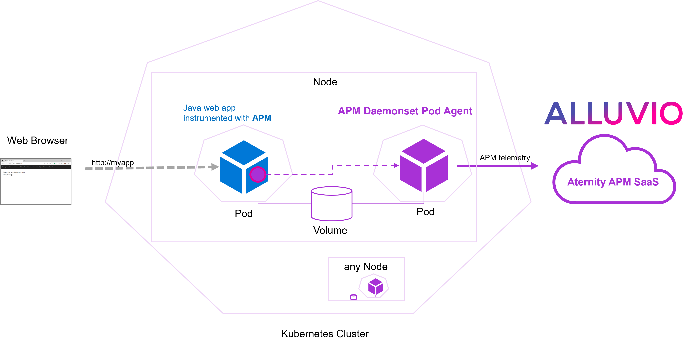
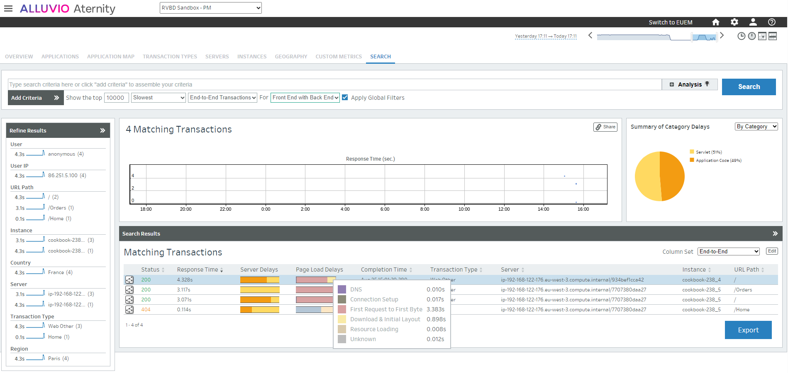

# 248-instrument-java-app-with-apm-daemonset-pod-agent-on-eks

This cookbook shows how to setup the ALLUVIO Aternity APM agent on a Kubernetes cluster in AWS, Elastic Kubernetes Serivce (EKS). 

After building a container image for the APM agent, the APM Agent is deployed on the cluster as a **Daemonset POD agent**, so that there is an instance of the agent running on every node and exposing the agent services for instrumented applications (e.g. DSA on port 2111). The [yaml manifest of the Daemonset POD agent](apm-daemonset-pod-agent.yaml) needs to be configured with the information of your ALLUVIO Aternity APM SaaS.

Then a simple Java web-application, built from [sources](app) and containerized with this [Dockerfile](app/Dockerfile), is deployed with multiple replicas on the cluster with APM instrumentation. Both [manifest with APM](app-k8s.yaml) and [initial manifest without APM](app-k8s-without-apm.yaml) are provided for comparison. In the manifest with APM, the shared volume of the APM agent is mounted to get access to the files of the agent (e.g. the Java agent library).



## Prerequisites

1. a SaaS account for [ALLUVIO Aternity APM](https://www.riverbed.com/products/application-performance-monitoring)

2. a ready to use Kubernetes environment created in AWS: a console like Cloud9 with CLI tooling installed (git, aws-cli, docker and kubectl), EKS cluster resources with a Node group (Linux x64) and an ECR image registry
   
## Step 1. Get the details for ALLUVIO Aternity APM

In the APM webconsole, from the Home page, hit "Deploy Collectors" and "Install now" button (or else navigate via the traditional menu: CONFIGURE > AGENTS > Install Agents).

Then in the Linux agent panel, switch to the "Standard Agent Install" to:

1. Find your **Customer Id**, for example *12341234-12341234-13241234*

2. Find your **SaaS Analysis Server Host**, for example *agents.apm.my_environment.aternity.com*

3. Download the latest **APM Linux Agent** package (also available on [Riverbed support](https://support.riverbed.com/content/support/software/aternity-dem/aternity-apm.html)), *appinternals_agent_latest_linux.gz*

Then in CONFIGURE > AGENTS > Configurations, 

4. Define an instrumentation configuration for the app and download the resulting .json file. 

For example, create a new configuration and simply name it "configuration", configure Data Collection Settings to enable End-User Experience Data collection, then hit Save, and at the top of the screen select Download in the dropdown list to fetch the file **configuration.json**

## Step 2. Open your shell

Run the following CLI in the terminal to download a local copy of the cookbook:

```shell
git clone https://github.com/Aternity/Tech-Community.git --depth 1

cd Tech-Community/248-instrument-java-app-with-apm-daemonset-pod-agent-on-eks
```

## Step 3. Build the image of the APM Daemonset POD Agent

1. Copy the APM Linux Agent package *appinternals_agent_latest_linux.gz* (prepared in Step 1.3) to the folder apm-customization/

2. Copy the APM configuration file (prepared in Step 1.4) to the subfolder apm-customization/config/
   
> [!WARNING]
> If the name of the configuration file is not configuration.json then edit the initial-mapping to adapt the startup auto-instrumentation mapping 

3. In the snippet below, replace the token {{ecr_region}} and {{aws_account_id}} with your own values. Execute the snippet to build the image of the APM agent locally, and push it to the ECR container registry. The build is based on a [Dockerfile](Dockerfile). 

```shell
ecr_region="{{ecr_region}}"  # replace {{ecr_region}}, for example: eu-west-3
aws_account_id="{{aws_account_id}}"  # replace {{aws_account_id}}, for example: 1234-5678-90

# 1. Connect docker to the ECR repository
aws ecr get-login-password --region $ecr_region | docker login --username AWS --password-stdin $aws_account_id.dkr.ecr.$ecr_region.amazonaws.com

# 2. Create a repository
repository_name="alluvio-aternity-apm-daemonset-pod-agent"
aws ecr create-repository --repository-name $repository_name --region $ecr_region

# 3. Build and push the container image
tag="23.8"
apm_agent_image_uri="$aws_account_id.dkr.ecr.$ecr_region.amazonaws.com/$repository_name:$tag"
docker build -t $apm_agent_image_uri .
docker push $apm_agent_image_uri

# 4. Display the URI of the APM agent container image
echo $apm_agent_image_uri
```

4. Grab the URI of the APM agent container image

The URI should be displayed in the terminal from the previous step. 

For example:

```
1234-5678-90.dkr.ecr.eu-west-3.amazonaws.com/alluvio-aternity-apm-daemonset-pod-agent:23.8
```

## Step 4. Deploy the APM Daemonset POD Agent on Kubernetes

1. Configure the manifest

Edit the Kubernetes manifest [apm-daemonset-pod-agent.yaml](apm-daemonset-pod-agent.yaml) to set the image path and the environment variables to configure the APM agent with the actual values prepared in previous steps (Step 1 and Step 3):

- replace {{ALLUVIO Aternity APM Daemonset POD agent image}} with the **URI of the APM agent container image** built in the previous step (step 3.4), for example: *1234-5678-90.dkr.ecr.eu-west-3.amazonaws.com/alluvio-aternity-apm-daemonset-pod-agent:23.8*

- replace {{ALLUVIO_ATERNITY_APM_CUSTOMER_ID}} with the **Customer Id**, for example: *12341234-12341234-13241234*

- replace {{ALLUVIO_ATERNITY_APM_SAAS_SERVER_HOST}} with the **SaaS Analysis Server Host**, for example: *agents.apm.my_environment.aternity.com*


2. Deploy the APM Daemonset POD Agent

In the terminal, execute the command to deploy the daemonset,

```shell
kubectl apply -f apm-daemonset-pod-agent.yaml
```

After few minutes, the agents will show up in the APM webconsole, in CONFIGURE > AGENTS > Agent List.
Then, the SERVERS view will start to display the metrics of the different nodes (e.g. CPU utilization).

> [!TIP]
> To check the progress of the deployment on the cluster, you can run the following command in the terminal:
>
> ```shell
> kubectl --namespace alluvio-aternity get daemonset
>
> kubectl --namespace alluvio-aternity get pod
> ```

## Step 5. Deploy a web-application on Kubernetes with a manifest configured for APM instrumentation

1. Prepare the image of the app

In the snippet below, same as in Step 3, the token {{ecr_region}} and {{aws_account_id}} must be replaced with the values of your environment. 
Execute the snippet to build the image of app. The build is based on this [Dockerfile](app/Dockerfile).

```shell
ecr_region="{{ecr_region}}"  # replace {{ecr_region}}, for example: eu-west-3
aws_account_id="{{aws_account_id}}"  # replace {{aws_account_id}}, for example: 1234-5678-90

# 1. Connect docker to the ECR repository
aws ecr get-login-password --region $ecr_region | docker login --username AWS --password-stdin $aws_account_id.dkr.ecr.$ecr_region.amazonaws.com

# 2. Create a repository
repository_name="cookbook-248-app"
aws ecr create-repository --repository-name $repository_name --region $ecr_region

# 3. Build and push the container image of the app
tag="23.8"
cookbook_app_image_uri="$aws_account_id.dkr.ecr.$ecr_region.amazonaws.com/$repository_name:$tag"
docker build -t $cookbook_app_image_uri app/.
docker push $cookbook_app_image_uri

# 4. Display the URI of the app container image
echo $cookbook_app_image_uri
```

2. Grab the URI of the app container image

The URI should be displayed in the terminal from the previous step. 
For example:

```
1234-5678-90.dkr.ecr.eu-west-3.amazonaws.com/cookbook-248-app:23.8
```

3. Set the image of the app in the manifest configured for APM instrumentation

Edit the manifest [app/app-k8s.yaml](app/app-k8s.yaml) and find the container definition to replace {{java-app image}} with the URI of the image obtained in the previous step.

For example:

```yaml
    spec:
      containers:
      - name: app
        # TODO: Replace {{java-app image}} with the actual value
        image: 1234-5678-90.dkr.ecr.eu-west-3.amazonaws.com/cookbook-248-app:23.8
```

> [!WARNING]
> The manifest [app/app-k8s.yaml](app/app-k8s.yaml) has been configured for the APM instrumentation, it is based on the initial manifest [app/app-k8s-without-apm.yaml](app/app-k8s-without-apm.yaml).

4. Deploy the app

In the terminal, execute the following command to deploy the application on Kubernetes using the manifest configured for the APM instrumentation.

```shell
kubectl apply -f app/app-k8s.yaml
```

5. Find the external ip address of the app

After few minutes, execute the following command to obtain the external ip address exposing the app.

```shell
kubectl -n cookbook-app get svc
```

6. Navigate on the app

In your web browser, open the http url using the external IP address, for example http://external-ip-address and refresh multiple times in order to generate some traffic and application transactions.

## Step 6. Monitor in ALLUVIO Aternity APM webconsole 

Go to the APM webconsole to observe the application, every instance and every transaction.



#### License

Copyright (c) 2023 Riverbed

The contents provided here are licensed under the terms and conditions of the MIT License accompanying the software ("License"). The scripts are distributed "AS IS" as set forth in the License. The script also include certain third party code. All such third party code is also distributed "AS IS" and is licensed by the respective copyright holders under the applicable terms and conditions (including, without limitation, warranty and liability disclaimers) identified in the license notices accompanying the software.
