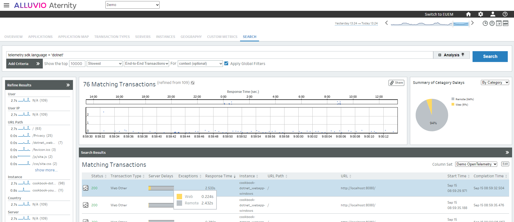

# 322-opentelemetry-on-kubernetes-with-apm-collector-daemonset-service-and-dotnet-app-on-windows

This cookbook for ALLUVIO Aternity shows how the [APM Collector](https://hub.docker.com/r/aternity/apm-collector) can be deployed on a Kubernetes cluster and exposed as a service.
For example, it can be used in a managed Kubernetes cluster in your favorite Cloud, like Azure AKS, AWS EKS or Google GKE.

The workloads that are outside the cluster, like Windows virtual machine or bare-metal machine, can be instrumented with [OpenTelemetry](https://opentelemetry.io) and export the telemetry to the APM Collector.
In this cookbook, a simple [.NET](https://dotnet.microsoft.com) webapp instrumented with [OpenTelemetry](https://opentelemetry.io), is containerized as a Windows container.


## Prerequisites

1. a SaaS account for [ALLUVIO Aternity APM](https://www.riverbed.com/products/application-performance-monitoring) with a license activated for OpenTelemetry

2. a Kubernetes cluster ready and manageable using kubectl CLI

3. a Windows host enabled with a Docker runtime, for example [Docker Desktop](https://www.docker.com/products/docker-desktop/) on a Windows Server virtual machine

## Step 1. Get the details for ALLUVIO Aternity APM

In the APM webconsole, from the Home page, hit "Deploy Collectors" and "Install now" button (or else navigate via the traditional menu: CONFIGURE > AGENTS > Install Agents).

Then in the Linux agent panel, switch to the "Standard Agent Install" to find:

1. your **Customer Id**, for example *12341234-12341234-13241234*

2. your **SaaS Analysis Server Host**, for example *agents.apm.my_environment.aternity.com*

## Step 2. Deploy the APM Collector on the Kubernetes cluster

1. Download the .yaml files of the cookbook, or ([download the full Tech Community zip archive](https://github.com/Aternity/Tech-Community/archive/refs/heads/main.zip))

2. Configure the .yaml manifest

Edit the Kubernetes manifest [apm-collector-daemonset.yaml](apm-collector-daemonset.yaml) to configure the environment variables for the APM Collector:

- replace {{ALLUVIO_ATERNITY_APM_CUSTOMER_ID}} with the **Customer Id**, for example: *12312341234-1234-124356*

- replace {{ALLUVIO_ATERNITY_APM_SAAS_SERVER_HOST}} with the **SaaS Analysis Server Host**, for example: *agents.apm.my-account.aternity.com*

3. Deploy the resources in the Kubernetes cluster

For example, in a shell go to your directory having the .yaml files and apply them with kubectl

```shell
# Go to the directory having the .yaml files
cd 322-opentelemetry-on-kubernetes-with-apm-collector-daemonset-service-and-dotnet-app-on-windows

# Deploy the daemonset
kubectl apply -f apm-collector-daemonset.yaml

# Deploy the service
kubectl apply -f apm-collector-daemonset-service.yaml
```

4. Wait a bit until the resources are ready, and find the external IP Address of the service

For example run the following command:

```shell
kubectl --namespace alluvio-aternity get service
```

## Step 3. Configure and deploy the instrumented app

On you Windows machine enabled with a Docker runtime,

1. Fetch the cookbook, for example hit the link to [download the full Tech Community zip archive](https://github.com/Aternity/Tech-Community/archive/refs/heads/main.zip) and expand the zip archive

2. Build the Windows container image

For example, execute the following command in a terminal

```PowerShell
# Go to the cookbook directory
cd 322-opentelemetry-on-kubernetes-with-apm-collector-daemonset-service-and-dotnet-app-on-windows

# Go the app folder
cd dotnet_webapp

# Build
docker build --tag dotnet_webapp:23.9.15 .
```

3. Configure the instrumentation with the OTLP endpoint and run the app

In the command below, replace {{ APM Collector - OTLP Endpoint }} with the actual endpoint exposed by the APM Collector, and execute it to run the app

```PowerShell
docker run --tty --rm --env OTEL_EXPORTER_OTLP_ENDPOINT="{{ APM Collector - OTLP Endpoint }}" --publish 8080:80 dotnet_webapp:23.9.15
```

For example, using 10.0.0.80 for the external IP Address obtained in the previous step,

```PowerShell
docker run --tty --rm --env OTEL_EXPORTER_OTLP_ENDPOINT="http://10.0.0.80:4317" --publish 8080:80 dotnet_webapp:23.9.15
```

4. Open a local browser, open the app on http://127.0.0.1:8080, and navigate multiple times on the different menus to generate some traces


## Step 4. Observe the traces in ALLUVIO Aternity APM webconsole 

In the APM webconsole, open the menu and go to the "Search" view to find all the OpenTelemetry traces of the app. 

The view allows to filter based on the traces attributes.

For example, the traces of the app can be found with the following query that keeps traces of any applications coded in .NET.

```query
telemetry.sdk.language=dotnet
```


