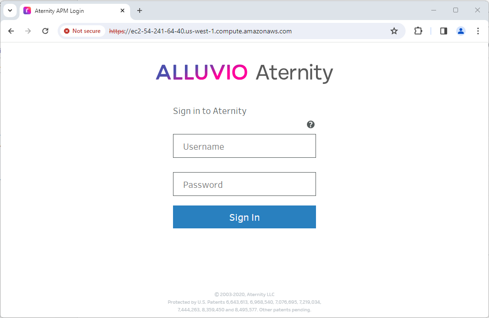

# 401 - APM Analysis Server on AWS EC2

This cookbook deploys the ALLUVIO Aternity [APM](https://www.riverbed.com/products/application-performance-monitoring/) Analysis Server in few clicks into your existing VPC/Subnet in your own AWS account.

## Prerequisites

1. an AWS Account
2. a temporary URL of the APM Analysis Server installer package, for example *https://yourstorage.com/folder/installer.tar?token=123&validity=12*
3. the checksum of the installer package, for example *123412341234...*

> [!TIP]
> Check the [Cookbook FAQ](#FAQ) and refer to the [Riverbed Support website](https://support.riverbed.com/content/support/software/aternity-dem/aternity-apm.html)

## Quick Start

In the table below, hit the **Launch Stack** button of the region where you want to deploy the APM Analysis Server.

Then follow the wizard in your AWS CloudFormation console. There, just enter the **temporary URL** and **checksum** of the installer, select a **Subnet** and a **Security Group**, scroll down and finally hit the **Create Stack** button to deploy the APM Analysis Server.

  
| Geo  | AWS Region | Hit & Deploy |
| --- | --- | --- | 
| US West | us-west-1 (N. California) |  |
| US West | us-west-2 (Oregon) |  |
| US East | us-east-1 (N. Virginia) |  |
| US East | us-east-2 (Ohio) |  |
| South America | sa-east-1 (Sao Paulo) |  |
| Canada | ca-west-1 (Calgary) |  |
| Canada | ca-central-1 (Central) |  |
| Africa | af-south-1 (Cape Town) |  |
| Europe | eu-west-1 (Ireland) |  |
| Europe | eu-west-2 (London) |  |
| Europe | eu-west-3 (Paris) |  |
| Europe | eu-north-1 (Stockholm) |  |
| Europe | eu-south-1 (Milan) |  |
| Europe | eu-south-2 (Spain) |  |
| Europe | eu-central-1 (Frankfurt) |  |
| Europe | eu-central-2 (Zurich) |  |
| Israel | il-central-1 (Tel Aviv) |  |
| Middle East | me-central-1 (UAE) |  |
| Middle East | me-south-1 (Bahrain) |  |
| Asia Pacific | ap-northeast-1 (Tokyo) |  |
| Asia Pacific | ap-northeast-2 (Seoul) |  |
| Asia Pacific | ap-northeast-3 (Osaka) |  |
| Asia Pacific | ap-south-1 (Mumbai) |  |
| Asia Pacific | ap-south-2 (Hyderabad) |  |
| Asia Pacific | ap-east-1 (Hong Kong) |  |
| Asia Pacific | ap-southeast-1 (Singapore) |  |
| Asia Pacific | ap-southeast-2 (Sydney) |  |
| Asia Pacific | ap-southeast-3 (Jakarta) |  |
| Asia Pacific | ap-southeast-4 (Melbourne) |  |

It is ready after just few minutes (usually less than 5 minutes) and you can connect and log into the webconsole.

## FAQ

### How to get a temporary URL for the installer package and the checksum?

From the [Riverbed Support page](https://support.riverbed.com/content/support/software/aternity-dem/aternity-apm.html) check for *Aternity APM Analysis Server (Linux Installer)* and download the latest version of the installer package. Then you can upload it in a storage of your choice, for example in a AWS S3 Bucket from which you can generate a temporary URL. Whether private or public, the URL must be accessible to the EC2 instance.

On the same [Riverbed Support page](https://support.riverbed.com/content/support/software/aternity-dem/aternity-apm.html), you can download the checksum file. It is a text file that contains the required checksum.

### How to connect to the APM Analysis Server console?

When the stack is created you should be able to connect to web console using the Public URL or Private URL:

- **Public URL**: [https://ec2-your-instance-ip.your_region.compute.amazonaws.com](https://ec2-your-instance.your_region.compute.amazonaws.com)
- **Private URL**: [https://ec2-your-instance-ip.your_region.compute.internal](https://ec2-your-instance.your_region.compute.internal)

> [!TIP]
> - To find the actual **Public URL** or **Private URL**, check the Outputs tab in the AWS CloudFormation stack. Or in the EC2 service, you shoud have a instance named **ALLUVIO Aternity APM Analysis Server**
> - If you cannot reach the page, check the connectivty. Possibly the Security Group associated to the EC2 might be blocking port 443
> - For the login / password, refer to the User Guide on [Riverbed Support](https://support.riverbed.com/content/support/software/aternity-dem/aternity-apm.html)

#### License

Copyright (c) 2024 Riverbed

The contents provided here are licensed under the terms and conditions of the MIT License accompanying the software ("License"). The scripts are distributed "AS IS" as set forth in the License. The script also include certain third party code. All such third party code is also distributed "AS IS" and is licensed by the respective copyright holders under the applicable terms and conditions (including, without limitation, warranty and liability disclaimers) identified in the license notices accompanying the software.
